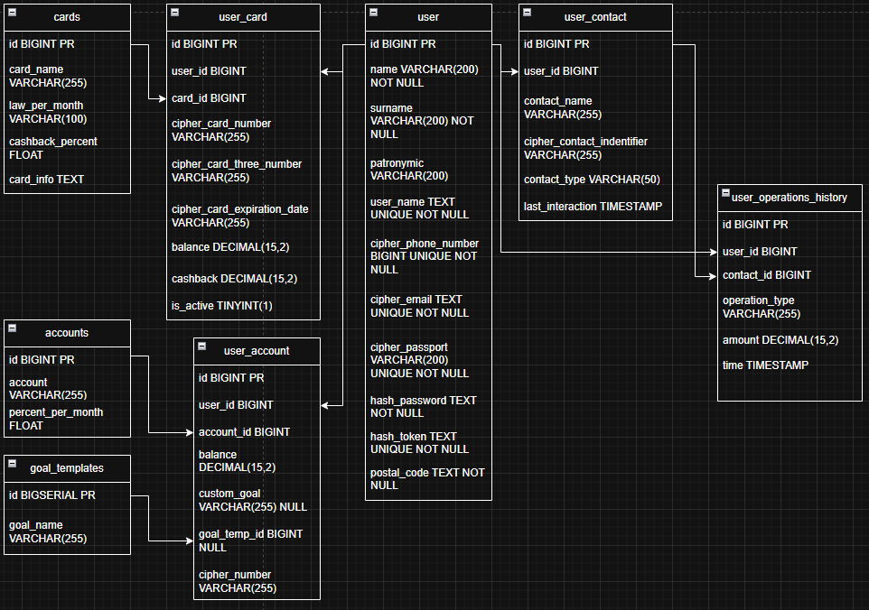

## Bank-Project

📌 О чем этот проект?

*Bank-Project* - учебный проект который был написан с целью более детального изучения экосистемы Spring и сопутствующих технологий.

В нем применяются:
- **Spring Framework** (Включая **Spring Security** и **Spring Data Jpa**);
- **Kotlin** для написания более кратких и лаконичных классов;
- **Redis** как NoSQL-хранилище для кэша;
- **JUnit и Mockito** для модульного тестирования;
- технологии *web-разработки*.

---
### ⚒️ Используемые технологии

- Java 17
- Spring boot 3.5.0
- Flyway 11.7.2
- MySQL 8.0
- Spring Security 6.5.0
- Kotlin 2.0.21
- Redis 7.2
- Thymeleaf 
- Lombok 1.18.38
- Argon 2
- Jasypt 1.9.3

--- 
### ✒️ Функционал

Данный проект является **симулятором банковского web приложения**. 

Основные возможности:

- Регистрация и авторизация пользователей;
- Просмотр информации в личном кабинете: Информация о пользователе (Имя, Фамилия, Email и т.д.);
- Изменение личных данных пользователя;
- Открытие разных типов карт;
- Создание накопительных счетов и постановка целей для накопления;
- Закрытие карт и счетов;
- Переводы: дмежуд картой и счетом, а так же другим пользователям по номеру карты или телефона;
- Смотреть историю своих транзакций.
  
---
### 🗄️Диаграмма базы данных



### ⚙️Структура проекта

``` bash
+---src
|   +---main
|   |   +---java
|   |   |   \---bank_project
|   |   |       |   BankProjectApplication.java
|   |   |       |
|   |   |       +---configuration
|   |   |       |
|   |   |       +---controller
|   |   |       |
|   |   |       +---dto
|   |   |       |   +---cache
|   |   |       |   |
|   |   |       |   +---request
|   |   |       |   |   |
|   |   |       |   |   \---request
|   |   |       |   |       \---transfer
|   |   |       |   \---view
|   |   |       |
|   |   |       +---entity
|   |   |       |   |
|   |   |       |   \---interfaces
|   |   |       |
|   |   |       +---exception
|   |   |       |   |
|   |   |       |   \---custom
|   |   |       |
|   |   |       +---mapper
|   |   |       |
|   |   |       +---repository
|   |   |       |   +---jpa
|   |   |       |   |
|   |   |       |   \---redis
|   |   |       |
|   |   |       +---security
|   |   |       |   +---security
|   |   |       |   |   \---configuration
|   |   |       |   |
|   |   |       |   \---token
|   |   |       |
|   |   |       \---service
|   |   |
|   |   \---resources
|   |       |   application.properties
|   |       |
|   |       +---db
|   |       |   \---migration
|   |       |
|   |       +---static
|   |       |   +---icons
|   |       |   |
|   |       |   \---style
|   |       |       +---account-order-blank-style
|   |       |       |
|   |       |       +---card-order-blank-style
|   |       |       |
|   |       |       +---card-order-page-style
|   |       |       |
|   |       |       +---global-style
|   |       |       |
|   |       |       +---history-page-style
|   |       |       |
|   |       |       +---login-page-style
|   |       |       |
|   |       |       +---main-page-style
|   |       |       |
|   |       |       +---new-account-page-style
|   |       |       |
|   |       |       +---registration-page-style
|   |       |       |
|   |       |       +---replenishment-page-style
|   |       |       |
|   |       |       +---reviews-page-style
|   |       |       |
|   |       |       +---support-page-style
|   |       |       |
|   |       |       \---user-page
|   |       |
|   |       \---templates
|   |
|   \---test
|       \---java
|           \---bank_project
|               |   BankProjectApplicationTests.java
|               |
|               +---account
|               |   \---test
|               |
|               +---card
|               |   \---test
|               |
|               \---transfer
|                   \---test
```

*Полная структура проекта доступна здесь ->* [Полная структура проекта](https://github.com/pepegazxc/Bank-Project/blob/main/forReadme/Full%20Project%20Structure.md)

### 🧩Запуск проекта

Склонируйте репозиторий:
``` bash
git clone https://github.com/pepegazxc/Bank-Project.git
cd Bank-Project
```

Перед запуском убедитесь что у вас установленно:
- **Java 17 +**

Так же не забудьте создать файл **в корне проекта** файл *env.properties* и указать в нем:
- MYSQL_PASSWORD=...
- MYSQL_URL=...
- MYSQL_USERNAME=...
  
- REDIS_URL=...
- REDIS_PORT=... 
- REDIS_PASSWORD=...  
- REDIS_USERNAME=... 
  
- KEY_FOR_CIPHER=...
- CIPHER_ALGORITHM=...

Запустите его:
``` bash
.\mvnw clean install #Windows (PowerShell)
.\mvnw spring-boot:run

./mvnw clean install #Linux/MacOS  
./mvnw spring-boot:run 

```
### 📋Список будущих изменений (Roadmap)

- [x] Добавить  тесты для AccountService
- [x] Добавить  тесты для CardService
- [x] Добавить  тесты для RedisService
- [x] Добавить  тесты для остальных методов сервиса TransferService
- [ ] Сделать приложение более устойчивым 
- [ ] Сделать функионал для страницы отзывов
- [ ] Сдеать функционал для страницы Технической поддержки
- [ ] Сделать возможность отображения новостей на главной странице

### ✍️ Автор

🐈‍⬛GitHub: https://github.com/pepegazxc

✉️ Telegram: https://t.me/pepegazxcc
